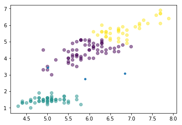
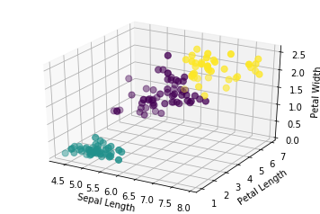

# K-means-Algorithm

Application of the K-means Clustering Algorithm on the Iris Dataset.

This graph shows the 2 dimensional representation of the iris petal length, width sepal length.

This graph shows the 3 dimensional representation of the iris petal length, width sepal length.

Homework Assignment:

Implement the K-means algorithm from scratch, and test it on the classic Fisher's Iris dataset.

K-means Algorithm Summary
Initialize your k cluster centroids (randomly select k different observations)
Compute the distance between each point and every centroid
Assign each data point to the centroid closest to it
Move the cluster centroid to the center (mean) of all the points assigned to it
Repeat until you reach stopping criteria (either convergence or maximum iterations)
Typically k-means is performed on scaled data.

Part 1: Implementation
You should implement k-means using either a functional or object-oriented approach. An object-oriented implementation might have a KMeans class with a "fit" method, and a functional implementation might have a "k_means" function that takes the data and numer of clusters as arguments and returns the centroids and assignemnts.

Load the dataset with sklearn.datasets.load_iris(), but since we will be hand coding our Kmeans in numpy we only need to get the features into an array. Create a numpy array of the features of the iris dataset. Do not use the labels for the clustering.

Using Numpy, initialize your cluster centers by selecting random data points. We will try our algorithm with multiple different k but let us start with 10. Pick at random 10 of our initial points. (Hint: try using random.sample)

For each one of your data points, compute the Euclidean distance between it and every centroid. Assign the point to the closest centroid.

Update each centroid by moving it to the center of all the points assigned to it. (E.g. make it the average of all the points in the cluster.)

Repeat steps 3 and 4 until convergence or max_iter is reached. If no cluster assignments change between iterations, then the algorithm has converged.

Part 2: Selecting k
Often it is tough to pick an ideal k in advance. We can force k in our case if we want a predetermined number of sections/topics. But it is most likely better to vary k and let the algorithm tell us what it wants. We can do choose an optimal k using the elbow method.

Run the algorithm with increasing values of k. For each, compute the sum of squared error (SSE). This is the distance of each point to its final centroid, squared, and summed over all datas points. Plot this for each value of k and try to find an elbow. Determining the number of clusters. Is there an optimal # of K?

Another metric to assess how well your data has been clustered is the Silhouette coefficient. Using scikit-learn's metric package compute the silhouette coefficient of the clusters produced by your own Kmeans implementation on the iris data.

Visualize the centroid assignments. Create a plot of the cluster assignments on the iris data. Each data point should be colored according to its assignment. First make a 2-d plot of each pair of features for the iris dataset. If you are feeling fancy make a 3-d plot.

